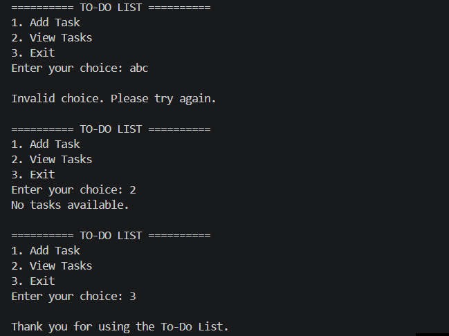
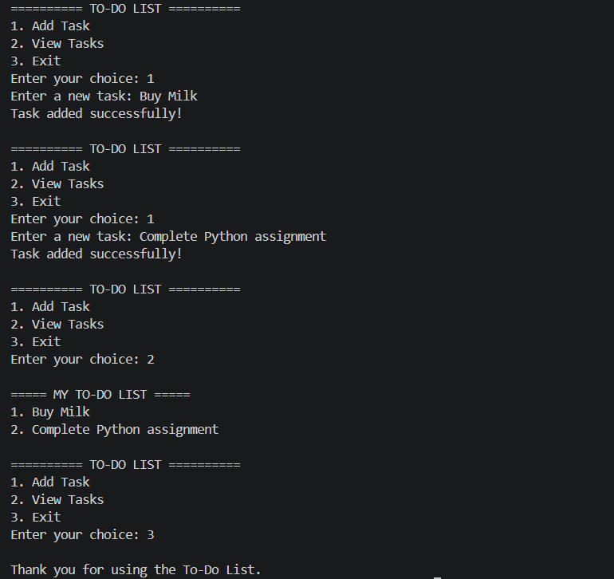

# To-Do List

## Description

The **To-Do List** is a Python console application developed to help users organize and manage their daily tasks efficiently. The program allows users to add new tasks, view all saved tasks, and exit the application through a simple menu-driven interface. It demonstrates the fundamental concepts of Python programming while providing a practical task management solution.


## Features

- Add new tasks to the to-do list
- View all saved tasks
- Menu-driven interface
- Displays tasks with numbering using `enumerate()`
- Handles empty task lists gracefully
- Simple and user-friendly console interface


## Python Concepts Used

- Variables
- Lists
- Functions
- Loops
- Conditional Statements
- User Input
- `append()`
- `enumerate()`


## How to Run

### Clone the repository

```bash
git clone https://github.com/nirma-waleed/DecodeLabs-Internship.git
```

### Navigate to the project folder

```bash
cd DecodeLabs-Internship/project1_Todo_List
```

### Run the program

```bash
python Todo_List.py
```


## Screenshots

### Input Validation

The application handles invalid menu selections and prompts the user to enter a valid option.



### Todo_List Output

The application successfully adds tasks and displays them in a numbered list.



## Learning Outcomes

Through this project, I learned how to:

- Build a menu-driven Python application
- Store and manage data using lists
- Create reusable functions
- Use loops and conditional statements effectively
- Display data using `enumerate()`
- Improve problem-solving and logical thinking


## Conclusion

The **To-Do List** project demonstrates the fundamental concepts of Python programming by applying them to a practical real-world problem. It showcases the use of lists, functions, loops, conditional statements, user input, and the Input → Process → Output (IPO) model to build a simple and reliable task management application.