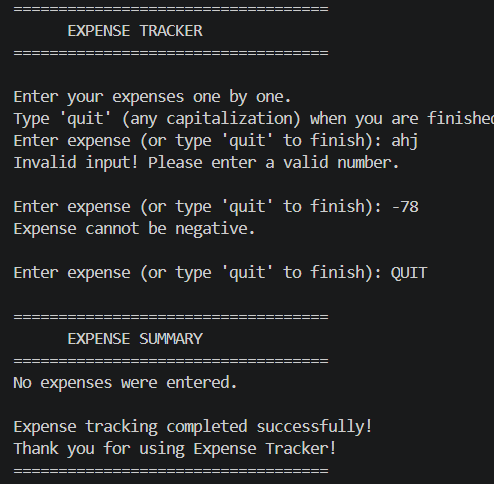
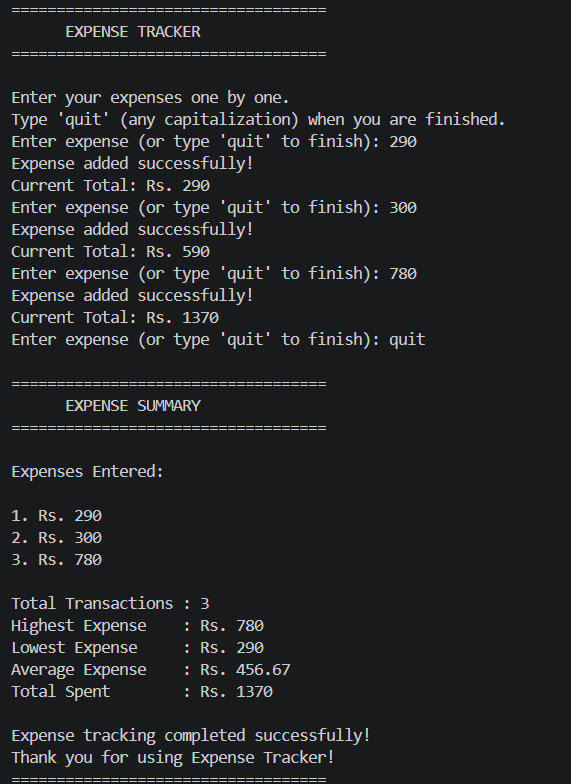

# Expense Tracker

## Project Description

The **Expense Tracker** is a Python console application that helps users record and manage their daily expenses. Users can enter multiple expense amounts, and the application automatically calculates the total amount spent. It validates user input, prevents invalid entries, and displays a summary including the total transactions, highest expense, lowest expense, average expense, and total amount spent.

This project demonstrates fundamental Python programming concepts such as loops, accumulators, input validation, error handling, lists, and the **Input → Process → Output (IPO)** model.

## Features

* Add multiple expense amounts.
* Calculate the total spent using the accumulator pattern.
* Accept continuous user input using `while True`.
* Exit the program using the sentinel value `quit`.
* Handle invalid input using `try` and `except ValueError`.
* Prevent negative expense entries.
* Display the running total after each valid expense.
* Store all entered expenses.
* Display an expense summary with:

  * Total Transactions
  * Highest Expense
  * Lowest Expense
  * Average Expense
  * Total Spent


## How to Run

1. Open the project folder in Visual Studio Code.
2. Open the terminal.
3. Navigate to the project folder:

```bash
cd project2_Expense_Tracker
```

4. Run the program:

```bash
python Expense_Tracker.py
```


## Sample Output

```text
===================================
      EXPENSE TRACKER
===================================

Enter your expenses one by one.
Type 'quit' (any capitalization) when you are finished.

Enter expense (or type 'quit' to finish): 100
Expense added successfully!
Current Total: Rs. 100

Enter expense (or type 'quit' to finish): 50
Expense added successfully!
Current Total: Rs. 150

Enter expense (or type 'quit' to finish): quit

===================================
      EXPENSE SUMMARY
===================================

Expenses Entered:

1. Rs. 100
2. Rs. 50

Total Transactions : 2
Highest Expense    : Rs. 100
Lowest Expense     : Rs. 50
Average Expense    : Rs. 75.00
Total Spent        : Rs. 150

Expense tracking completed successfully!
Thank you for using Expense Tracker!
===================================
```

## Learning Outcomes

Through this project, I learned:

* Variables and data types
* User input and output
* Type conversion using `int()`
* The accumulator pattern (`total += expense`)
* Loops using `while True`
* Sentinel values (`quit`)
* Exception handling with `try` and `except`
* Lists in Python
* Basic mathematical operations
* Input → Process → Output (IPO) model
## Screenshots

### Handling Invalid Input



### Expense Tracker Output




## Conclusion

The **Expense Tracker** project demonstrates the fundamental concepts of Python programming through a practical application. It showcases the use of loops, accumulators, input validation, exception handling, lists, and the Input → Process → Output (IPO) model to build a simple and reliable expense management application.


