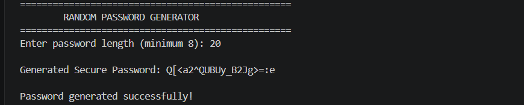
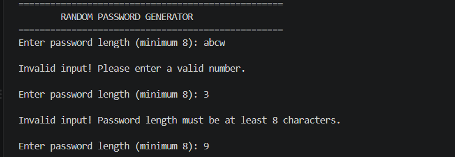

# Random Password Generator

## Project Overview

The **Random Password Generator** is a Python application that generates strong and secure passwords based on a user-defined length. It demonstrates the use of Python's built-in libraries to create random passwords while following secure programming practices.


## Objective

The objective of this project is to develop a secure password generator that:

* Accepts the desired password length from the user.
* Validates user input.
* Generates a secure random password.
* Displays the generated password.


## Features

* User-defined password length
* Minimum password length validation (8 characters)
* Secure password generation using the `secrets` module
* Uses the `string` module for predefined character sets
* Includes uppercase letters, lowercase letters, numbers, and special characters
* Input validation using `try` and `except`
* Modular and reusable code using functions


## Concepts Used

* Input → Process → Output (IPO) Model
* Python Modules
* Functions
* Exception Handling
* Lists
* Loops
* String Manipulation
* Secure Random Generation


## Modules Used

* `secrets`
* `string`


## How to Run

1. Open a terminal in the project folder.
2. Run the following command:

```bash
python password_generator.py
```

3. Enter the desired password length (minimum 8 characters).
4. The program will generate and display a secure password.

---

## Sample Output

```text
==================================================
        RANDOM PASSWORD GENERATOR
==================================================

Enter password length (minimum 8): 12

Generated Secure Password:
A#7mQ9!kLp2@

Password generated successfully!
```

---

## Input Validation

The program handles invalid inputs such as:

* Non-numeric values
* Password lengths less than 8 characters

Example:

```text
Enter password length (minimum 8): abc

Invalid input! Please enter a valid number.
```

```text
Enter password length (minimum 8): 5
Invalid input! Password length must be at least 8 characters.
```


## Learning Outcomes

Through this project, I learned how to:

* Generate secure passwords using Python's `secrets` module.
* Use the `string` module to access predefined character sets.
* Validate user input using exception handling.
* Build modular programs using functions.
* Apply the Input → Process → Output (IPO) programming model.
* Write clean, readable, and maintainable Python code.

## Screenshots

### Successful Password Generation



### Input Validation



## Conclusion

The **Random Password Generator** project demonstrates the fundamental concepts of Python programming through a practical security-focused application. It showcases the use of Python modules, functions, loops, lists, input validation, exception handling, and the Input → Process → Output (IPO) model to build a secure and reliable password generation tool. The project also highlights the importance of using cryptographically secure randomness through Python's `secrets` module and efficient string manipulation techniques to create strong passwords suitable for modern applications.

